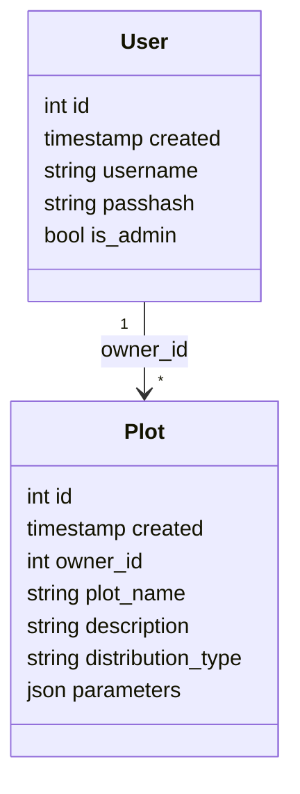

```mermaid   
classDiagram
    class User {
        int id
        timestamp created
        string username
        string passhash
        bool is_admin
    }

    class Plot {
        int id
        timestamp created
        int owner_id
        string plot_name
        string description
        string distribution_type
        json parameters
    }

    User "1" --> "*" Plot : owner_id
```