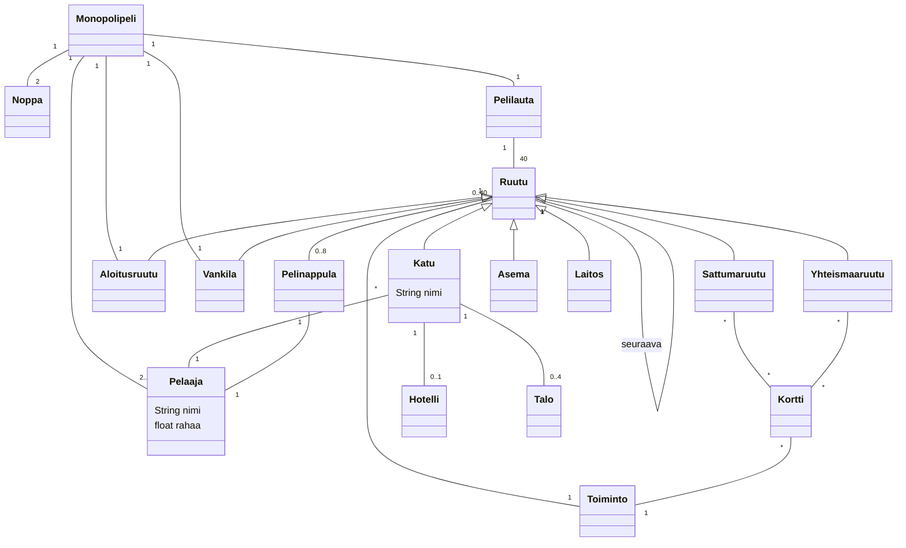

```mermaid
classDiagram
	class Pelaaja {
		String nimi
		float rahaa
		}
	class Katu {
		String nimi
		}
	
Monopolipeli "1" -- "2" Noppa
Monopolipeli "1" -- "1" Pelilauta
Monopolipeli "1" -- "2..8" Pelaaja
Monopolipeli "1" -- "1" Aloitusruutu
Monopolipeli "1" -- "1" Vankila
Pelilauta "1" -- "40" Ruutu
Ruutu "1" -- "1" Ruutu : seuraava
Ruutu "1" -- "0..8" Pelinappula
Ruutu "0..40" -- "1" Toiminto
Ruutu <|-- Aloitusruutu
Ruutu <|-- Sattumaruutu
Ruutu <|-- Yhteismaaruutu
Ruutu <|-- Vankila
Ruutu <|-- Asema
Ruutu <|-- Laitos
Ruutu <|-- Katu
Sattumaruutu "*" -- "*" Kortti
Yhteismaaruutu "*" -- "*" Kortti
Katu "*" -- "1" Pelaaja
Katu "1" -- "0..1" Hotelli
Katu "1" -- "0..4" Talo
Kortti "*" -- "1" Toiminto
Pelinappula "1" -- "1" Pelaaja
```

